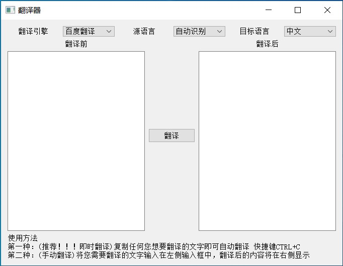

# 一个简单好用的图形化翻译器

> **目前支持的翻译引擎有**
> - [x] 百度翻译
> - [ ] 谷歌翻译
> - [ ] 有道翻译
> - [ ] 搜狗翻译
> - [ ] 必应翻译

## 使用须知
使用前请先配置好`settings.py`，如翻译引擎所需的APPID、密钥等。

配置完成后运行`main.py`

## 使用方法
1. 方法一：(自动翻译)复制任何您需要翻译的文字即可自动翻译 (tips: CTRL+C)
2. 方法二：(手动翻译)将您需要翻译的文字输入在左侧编辑框中，点击翻译按钮翻译后的内容将出现在右侧编辑框

## Last
本项目GUI采用的是`Pyside2`模块，由于`Pyside2`模块相比`PyQT5`来说较新，相关资料也相对来说较少，可能在使用时会经常踩坑却对这些坑无从下手。作者在长期使用`Pyside2`模块时也遇到不少问题，不过大部分都解决了，如果您在使用时遇到任何困难，欢迎提交Issue，我很乐意解答。
