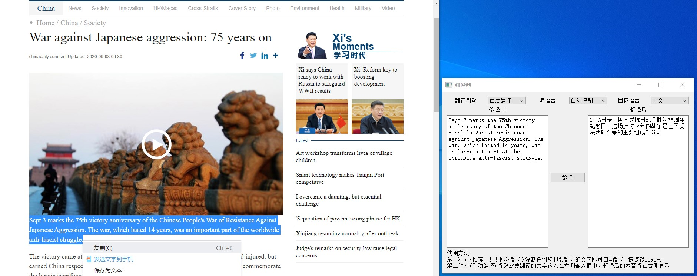
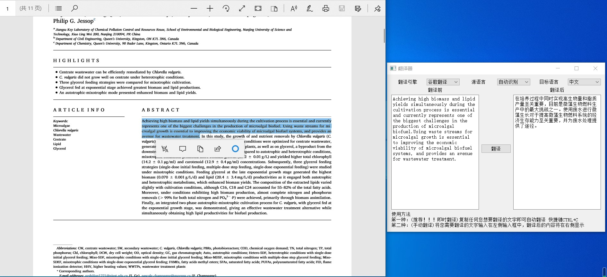

# 一个简单好用的图形化翻译器

> **目前支持的翻译引擎有**
> - [x] 百度翻译
> - [x] 谷歌翻译 (无需配置，直接使用) (默认)
> - [x] 有道翻译 (无需配置，直接使用)
> - [ ] 搜狗翻译
> - [ ] 必应翻译
> - [x] 腾讯翻译
> - [x] 彩云小译

## 项目背景
目前，无论是在线翻译还是翻译软件，在使用时都避免不了手动输入或需要先将翻译内容复制再切换到翻译页面中，如此繁琐的过程实在耗费了很多不必要的时间。
而作者在本科生阶段由于需要翻阅英文文献，在翻译英文时为了避免不必要的时间浪费，此项目由此诞生。

## 项目特点
使用此软件，您只需选取您所需要翻译的内容，按下 `CTRL+C` 快捷键或点击 `复制` ，翻译后的内容即可出现在软件界面中。
当然，您也可以手动输入翻译内容，使用方法和正常使用有道翻译、谷歌翻译等翻译软件无任何区别。(您甚至可以删除那些累赘的翻译软件了！)
此项目原理为不断监听剪切板内容，在剪切板内容改变时触发翻译，再将翻译后的内容呈现在界面中。

## 使用须知
使用前请先配置好`settings.py`，如翻译引擎所需的APPID、密钥等。

配置完成后运行`main.py`

## 使用方法
1. 方法一：(自动翻译)复制任何您需要翻译的文字即可自动翻译 (tips: CTRL+C)
2. 方法二：(手动翻译)将您需要翻译的文字输入在左侧编辑框中，点击翻译按钮翻译后的内容将出现在右侧编辑框

## Last
本项目GUI采用的是`Pyside2`模块，由于`Pyside2`模块相比`PyQT5`来说较新，相关资料也相对来说较少，可能在使用时会经常踩坑却对这些坑无从下手。作者在长期使用`Pyside2`模块时也遇到不少问题，不过大部分都解决了，如果您在使用时遇到任何困难，欢迎提交Issue，我很乐意解答。

目前还有部分翻译引擎未实现，由于作者精力有限，欢迎有兴趣完成此项目者提交 `pull request` ，您只需按照 `trans` 下的模块依葫芦画瓢创建类并复写 `translate` 方法即可。

如果您觉得这个项目对您有用，请给作者一颗 `star` ，感谢大家的支持！